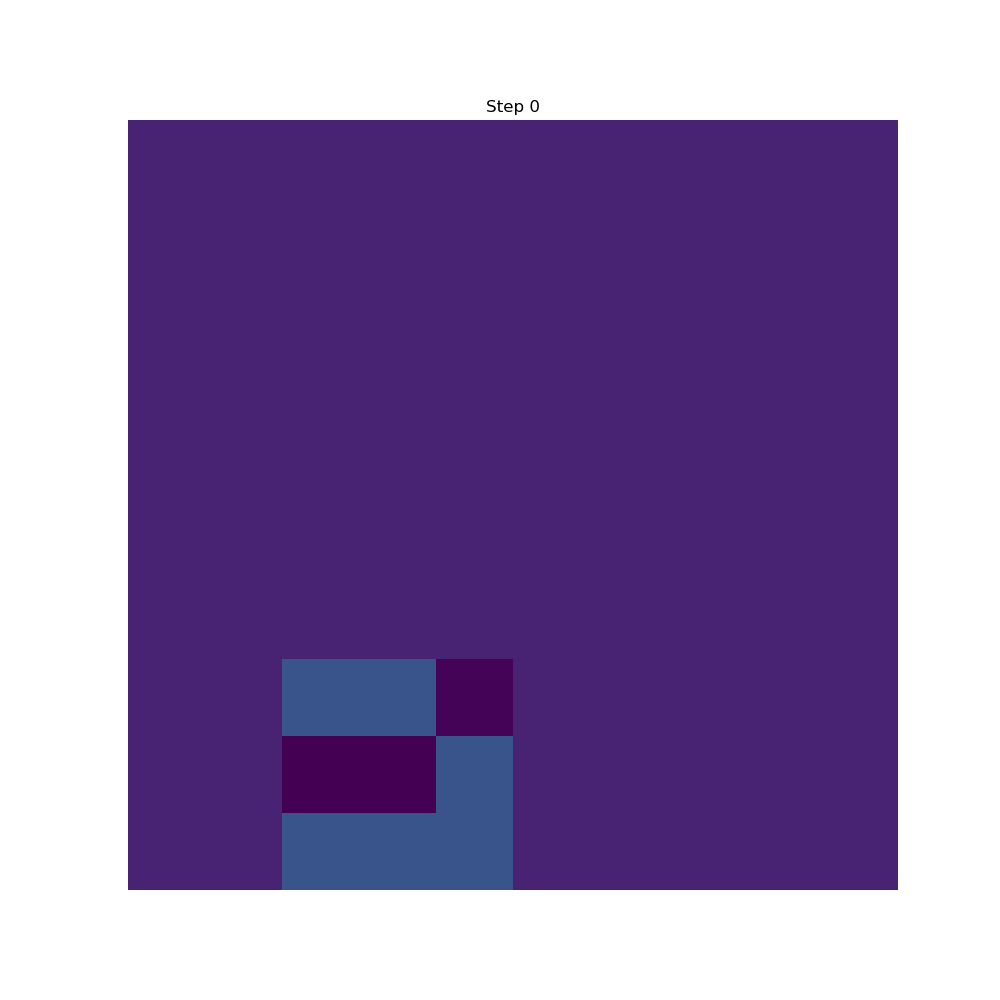
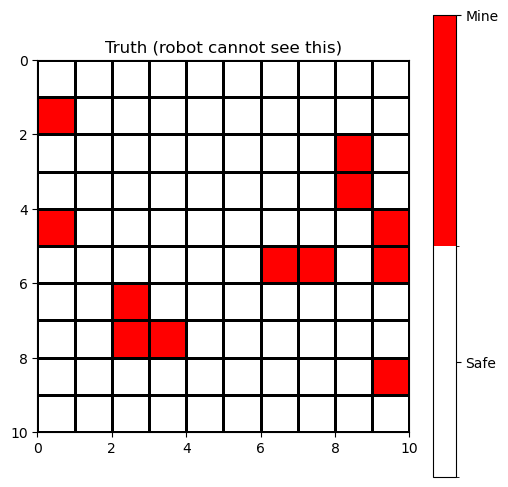
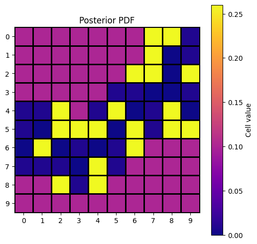
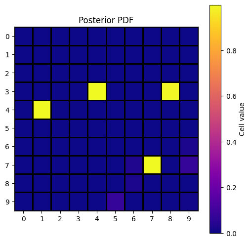
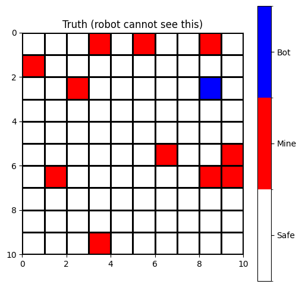
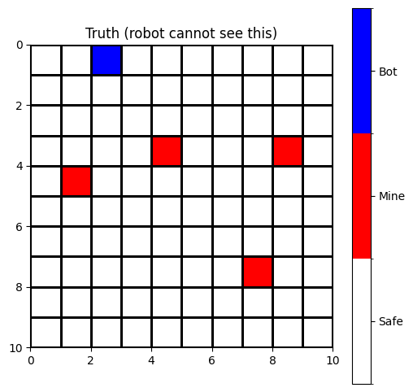

# Expected Free Energy Minefield Demo

  
  

*Left: posterior sharpening over time. Right: hidden ground-truth minefield*

*A robot with a noisy sensor explores minefield using Bayesian inference and expected free energy (EFE). The posterior over mines sharpens step by step as the agent balances risk and information gain.*

---
 
This repo contains a simple demo of a robot exploring a noisy minefield using **expected free energy** (EFE) and Bayesian statistics.

The robot holds a generative model of the world (beta-bernoulli over mine presence and a noisy mine sensor). At each stage we compute the posterior mine probabilities (the risk) and take off the difference between the prior entropy and the evidence wieghted entropy of each outcome of a given move. The move with the lowest expected free energy is then selected.

The robot balances:
- **Epistemic gain**: information gain from probing new cells.
- **Extrinsic risk**: risk of stepping on a mine.

Written in haste.

---

## Generative model of the minefield

Each cell \(s_i \in \{0,1\}\) (mine or no mine) has a bernoulli parameter of 0.1

%2C%20%5Cquad%20%5Cforall%20(i%2Cj)%20%5Cin%20%5Ctext%7Bgrid%7D)

The joint distribution of the grid is therefore:

%20%3D%20%5Cprod_%7Bi%2Cj%7D%20%5Ctext%7BBernoulli%7D(S_%7Bij%7D%3B%20%5Ctheta)%2C%20%5Cquad%20%5Ctheta%20%3D%200.1)

---

## Posterior update

Let a be probability of detecting a mine when there is a mine present (0.95):

)  

Let 1-a be the probability of not detecting a mine when there is a mine present 0.05:

)  

Let b be the probability of detecting a mine when there is no mine present (0.3)

)  

Let 1-b be the probability of not detecting a mine when there is no mine present (0.7)

)  

In summary the sensor has a confusion matrix:

%7D%20%26%20P(o%3D1%5Cmid%20s%3D1)%3D0.95%20%26%20P(o%3D0%5Cmid%20s%3D1)%3D0.05%20%5C%5C%20%5Ctextbf%7BSafe%20(s%3D0)%7D%20%26%20P(o%3D1%5Cmid%20s%3D0)%3D0.30%20%26%20P(o%3D0%5Cmid%20s%3D0)%3D0.70%20%5Cend%7Barray%7D)

Now we can define the likelihood of performing n mine detections with k detects and n-k non detects for a single cell **given there is a mine there**:

%20%3D%20a^{k}(1-a)^{n-k})

and define the likelihood of performing n mine detections with k detects and n-k non detects for a single cell **given there is no mine there**:

%20%3D%20b^{k}(1-b)^{n-k})

### Bayes’ rule with those likelihoods

%20%3D%20%5Cfrac{P(\text{data}\mid%20S%3D1)P(S%3D1)}{P(\text{data}\mid%20S%3D1)P(S%3D1)%20%2B%20P(\text{data}\mid%20S%3D0)P(S%3D0)})

Substituting the likelihoods:

%20%3D%20%5Cfrac{p%20a^{k}(1-a)^{n-k}}{p%20a^{k}(1-a)^{n-k}%20+%20(1-p)%20b^{k}(1-b)^{n-k}})

---

###  Expected Free Energy (EFE)
For an action \(a\) (moving in a particular direction compass direction N,S,W,E,NE,NW,SE,SW):

%20%3D%20%5Cunderbrace%7B%5Cmathbb%7BE%7D_%7Bq(o%7Ca)%7D%5B-%5Cln%20p(o)%5D%7D_%7B%5Ctext%7Bextrinsic%20risk%7D%7D%20-%20%5Cunderbrace%7B%5Cbig(H%5Bq(s)%5D%20-%20%5Cmathbb%7BE%7D_%7Bq(o%7Ca)%7D%5BH(q(s%7Co,a))%5D%5Cbig)%7D_%7B%5Ctext%7Bepistemic%20gain%7D%7D)

- ) : current posterior belief  
- ) : imagined posterior after seeing \(o\) at cell \(a\)  
-  : entropy  

Entropy of a Bernoulli with parameter \(p\):

%20%3D%20-%5Cbig(p%5Cln%20p%20&plus;%20(1-p)%5Cln(1-p)%5Cbig))

The agent picks the action \(a^*\) with lowest EFE, trading off exploration (epistemic gain) against exploitation (low risk).

## Notebooks

- **naieve_EFE_no_revisit.ipynb** — the robot samples each tile at most once. Revisits confer no additional information.  
- **EFE_revisit.ipynb** — the robot can re-probe tiles. Revisits confer additional information and yield a sharper posterior.

---

## Single-visit vs. revisit

**Posterior PDFs**

  
  

*Left: single-visit posterior stays diffuse. Right: revisits drive probabilities sharply toward 0/1.*

**Boards**

  
  

*Ground truths of the boards.*

---

## Run the notebooks

You can view the notebooks on GitHub or run them in Colab:

- **naieve_EFE_no_revisit.ipynb**  
  

- **EFE_revisit.ipynb**  
  
